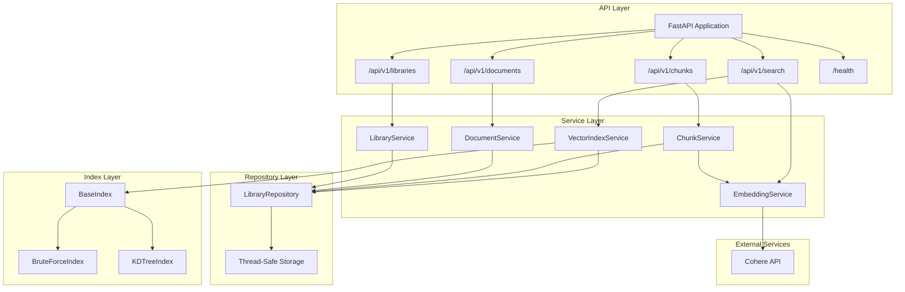
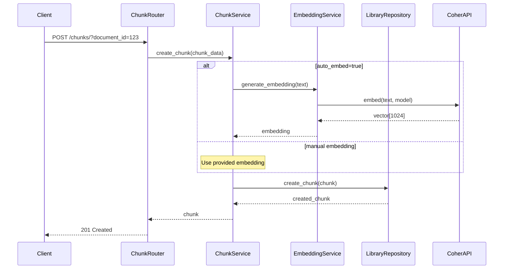
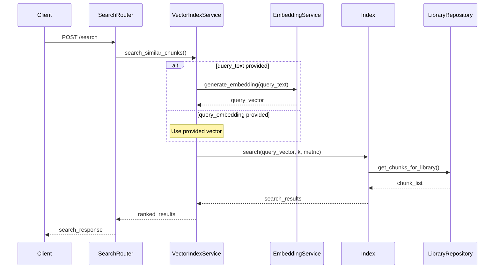

# StackAI Vector Database Architecture

## Overview

StackAI is a production-ready vector database built with FastAPI, featuring custom indexing algorithms, thread-safe operations, and comprehensive testing. The architecture follows clean separation of concerns with layered design patterns.

## Core Architecture Principles

- **Domain-Driven Design**: Clear separation between API, business logic, and data layers
- **SOLID Principles**: Single responsibility, dependency injection, interface segregation
- **Composition over Inheritance**: Services compose repositories and indexes
- **Thread Safety**: RLock-based concurrency control
- **Type Safety**: Full static typing with Pydantic validation

## System Architecture



## Component Details

### API Layer (FastAPI Routers)

**Purpose**: Handle HTTP requests, validation, and response formatting

**Components**:
- `libraries.py`: CRUD operations for library management
- `documents.py`: Document lifecycle within libraries
- `chunks.py`: Text chunk operations with embedding support
- `search.py`: Vector similarity search and index management

**Key Features**:
- Automatic OpenAPI documentation generation
- Request/response validation with Pydantic
- Dependency injection for service layers
- Consistent error handling with proper HTTP status codes

### Service Layer (Business Logic)

**Purpose**: Orchestrate business operations and coordinate between components

**Components**:
- `LibraryService`: Library lifecycle and validation
- `DocumentService`: Document operations and library relationships
- `ChunkService`: Chunk processing with embedding coordination
- `VectorIndexService`: Index management and search orchestration
- `EmbeddingService`: Cohere API integration for auto-embedding

**Design Patterns**:
- **Service Layer Pattern**: Encapsulates business logic
- **Facade Pattern**: Simplifies complex subsystem interactions
- **Strategy Pattern**: Pluggable embedding strategies (manual vs auto)

### Repository Layer (Data Access)

**Purpose**: Centralized, thread-safe data storage and retrieval

**Implementation**: `LibraryRepository`
- **Thread Safety**: `threading.RLock()` protects all operations
- **In-Memory Storage**: Dictionaries for fast access with relationship tracking
- **CRUD Operations**: Complete lifecycle management for all entities
- **Data Integrity**: Cascading operations and referential consistency

**Data Structure**:
```python
{
    '_libraries': Dict[UUID, Library],
    '_documents': Dict[UUID, Document], 
    '_chunks': Dict[UUID, Chunk],
    '_library_documents': Dict[UUID, Set[UUID]],
    '_document_chunks': Dict[UUID, Set[UUID]],
    '_document_library': Dict[UUID, UUID],
    '_chunk_document': Dict[UUID, UUID]
}
```

### Index Layer (Vector Search)

**Purpose**: Efficient similarity search over high-dimensional vectors

**Base Implementation**: `BaseIndex`
- Abstract interface for all index types
- Standardized search operations with multiple similarity metrics
- Thread-safe operations with consistent API

**Algorithms**:

1. **BruteForceIndex**
   - **Method**: Linear scan through all vectors
   - **Complexity**: O(n) search, O(1) indexing
   - **Best For**: Small datasets (<10K chunks), guaranteed accuracy
   - **Memory**: Minimal overhead

2. **KDTreeIndex** 
   - **Method**: Binary space partitioning tree
   - **Complexity**: O(log n) average search, O(n log n) indexing
   - **Best For**: Medium datasets (1K-100K chunks), moderate dimensions
   - **Memory**: Tree structure overhead

**Similarity Metrics**:
- **Cosine Similarity**: Angle-based, ideal for text embeddings
- **Euclidean Distance**: L2 norm, magnitude-sensitive
- **Dot Product**: Fast computation, assumes normalized vectors

## Request Flow

### Chunk Creation with Auto-Embedding



### Vector Search Operation



## Concurrency Strategy

### Thread Safety Model

**Repository Level**:
- `threading.RLock()` (reentrant lock) protects all data operations
- Single lock per repository instance ensures consistency
- Granular locking would add complexity without significant benefit for in-memory storage

**Why RLock vs AsyncIO**:
- **RLock**: Simpler reasoning, proven reliability, allows reentrant calls
- **AsyncIO**: Would require async/await throughout, more complex for CPU-bound vector operations
- **Hybrid**: FastAPI handles async HTTP while internal operations use synchronous thread-safe code

**Lock Granularity**:
- **Coarse-grained**: Single repository lock
- **Benefits**: Deadlock prevention, simpler reasoning, atomic multi-entity operations
- **Trade-offs**: Reduced parallelism for independent operations

### Performance Considerations

**Memory Management**:
- Deep copying for data isolation
- Efficient dictionary-based lookups
- Relationship tracking with sets for O(1) membership

**Index Performance**:
- Lazy index building only when needed
- Configurable similarity metrics
- Memory-efficient vector storage

## Custom Algorithm Rationale

### Why Not FAISS/Pinecone?

**Educational Value**:
- Demonstrates understanding of vector search internals
- Shows algorithm implementation skills
- Allows customization for specific requirements

**Control & Flexibility**:
- Custom similarity metrics
- Tailored data structures
- No external service dependencies
- Simplified deployment

**Trade-offs**:
- **Performance**: FAISS would be faster for large-scale operations
- **Features**: Missing advanced features like LSH, PQ compression
- **Scalability**: Custom implementations have natural limits
- **Maintenance**: More code to maintain and test

**Production Considerations**:
- Current implementation suitable for proof-of-concept and medium-scale applications
- Would recommend FAISS/Pinecone for production at scale
- Easy migration path through abstract base classes

## Metadata Filtering Architecture

### Filter Engine Design

**MongoDB-Style Operators**:
```python
{
    "field": {"$operator": value},
    "nested.field": {"$operator": value},
    "multiple_conditions": "AND logic"
}
```

**Supported Operators**:
- **Comparison**: `$eq`, `$ne`, `$gt`, `$gte`, `$lt`, `$lte`
- **Membership**: `$in`, `$nin`
- **String**: `$contains`, `$regex`
- **Existence**: `$exists`
- **Date**: `$date_after`, `$date_before`, `$date_range`

**Performance Strategy**:
1. **Pre-filtering**: Apply metadata filters before vector search
2. **Result Expansion**: Request 3x more results to account for filtering
3. **Lazy Evaluation**: Only evaluate complex conditions when needed

## Docker Strategy

### Multi-Stage Dockerfile

**Build Stage**:
- Python 3.11 slim base image
- Dependency installation with pip caching
- Non-root user creation for security

**Runtime Stage**:
- Minimal attack surface
- Health check integration
- Proper signal handling for graceful shutdown

**Benefits**:
- Smaller final image size
- Security through principle of least privilege
- Production-ready configuration

## CI/CD Pipeline

### GitHub Actions Workflow

**Stages**:
1. **Linting**: Black, isort, flake8, mypy
2. **Unit Tests**: pytest with coverage reporting
3. **Integration Tests**: Full API workflow testing
4. **Docker Tests**: Container build and deployment verification
5. **Security Scanning**: Safety and Bandit checks
6. **Performance Tests**: Basic load testing

**Quality Gates**:
- 80% code coverage requirement
- All linting checks must pass
- Integration tests validate end-to-end workflows
- Docker containers must start and respond to health checks

## Scalability Considerations

### Current Limitations

**Memory Bounds**:
- In-memory storage limits dataset size
- No data persistence across restarts
- Single-node deployment only

**Performance Bounds**:
- Thread-based concurrency model
- Custom index algorithms vs optimized libraries
- No distributed search capabilities

### Future Enhancements

**Persistence Layer**:
- Database integration (PostgreSQL with pgvector)
- File-based persistence with crash recovery
- Incremental index updates

**Distributed Architecture**:
- Leader-follower replication for read scaling
- Horizontal sharding for write scaling
- Distributed consensus for consistency

**Algorithm Improvements**:
- Approximate Nearest Neighbor (ANN) algorithms
- Hierarchical clustering for large datasets
- GPU acceleration for vector operations

## Security & Reliability

### Security Measures

**Input Validation**:
- Pydantic schemas for all API inputs
- Type checking and bounds validation
- SQL injection prevention (no direct SQL)

**Access Control**:
- No authentication implemented (stateless design)
- Rate limiting not implemented (would add in production)
- CORS configuration for cross-origin requests

**Data Protection**:
- No sensitive data persistence
- Environment variable configuration
- Secure defaults for production deployment

### Reliability Features

**Error Handling**:
- Comprehensive exception catching
- Proper HTTP status codes
- Detailed error messages for debugging

**Health Monitoring**:
- Health check endpoint with service status
- Embedding service availability checking
- Docker health check integration

**Graceful Degradation**:
- Manual embedding fallback when Cohere unavailable
- Service-level error isolation
- Partial functionality during service outages

## Performance Characteristics

### Benchmark Expectations

**Small Dataset (1K chunks)**:
- Brute Force: ~10ms search latency
- KD-Tree: ~5ms search latency
- Index build: <100ms

**Medium Dataset (100K chunks)**:
- Brute Force: ~1s search latency
- KD-Tree: ~50ms search latency  
- Index build: ~10s

**Memory Usage**:
- ~1KB per chunk (text + metadata + embedding)
- ~2x overhead for index structures
- ~100MB for 100K chunks

### Optimization Opportunities

**Algorithmic**:
- Implement LSH for high-dimensional data
- Add approximate search options
- Optimize memory layout for cache efficiency

**System**:
- Add result caching layer
- Implement connection pooling for external APIs
- Use memory mapping for large datasets

**Monitoring**:
- Add performance metrics collection
- Implement request tracing
- Monitor resource utilization patterns

This architecture provides a solid foundation for a vector database while maintaining simplicity, educational value, and room for future enhancements. 